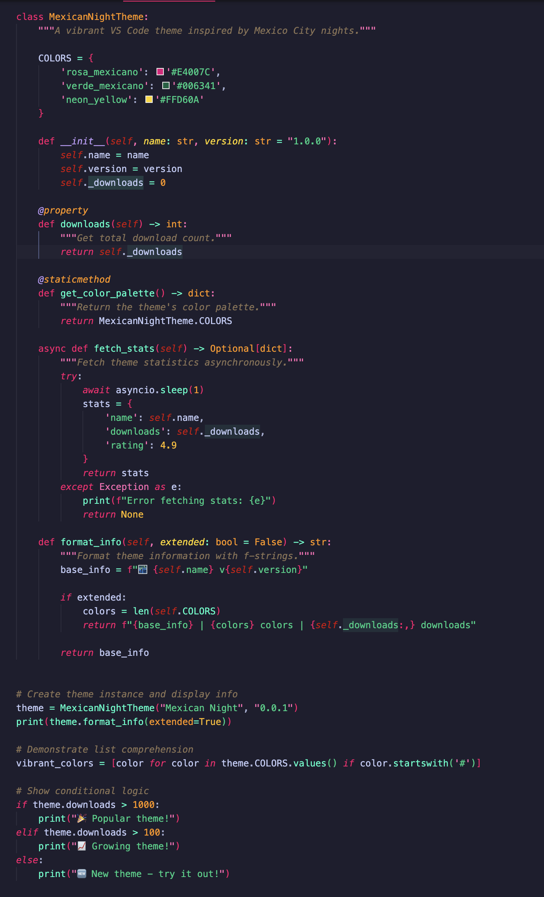
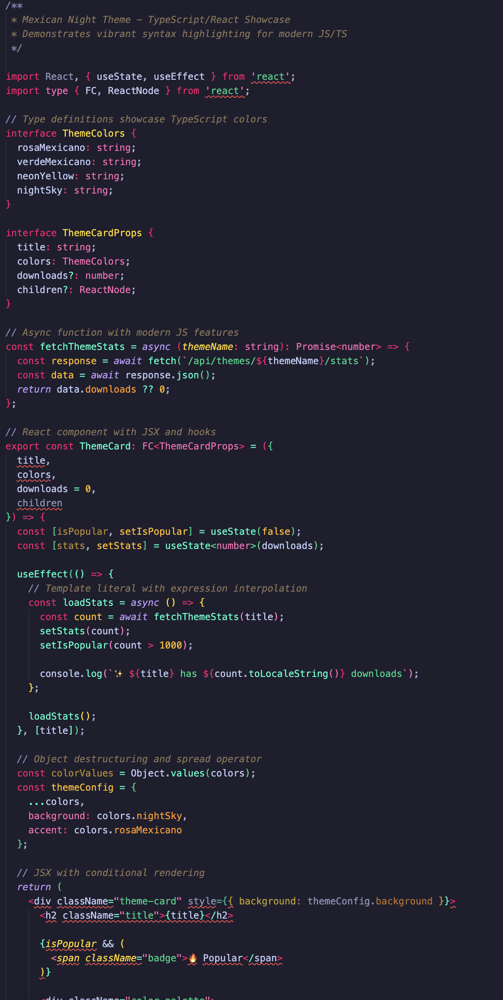
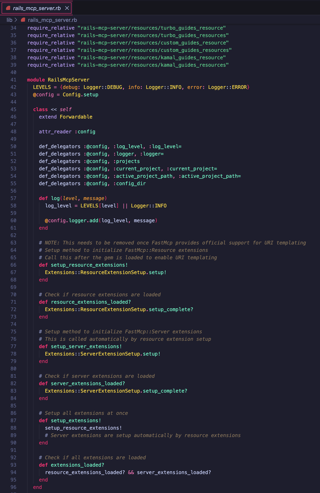

# 🌃 Mexican Night Theme

A vibrant VS Code theme that celebrates the lights of Mexico City at night, featuring Rosa Mexicano and Verde Mexicano as primary accent colors. Optimized for Python, Ruby, and JavaScript/TypeScript development with comprehensive syntax highlighting.

## 📸 Screenshots

### Python


### TypeScript/React


### Ruby


## 🎨 Color Palette

Mexican Night uses authentic Mexican-inspired colors:

- **Rosa Mexicano** (#ff006e) - Keywords, control flow, and primary accents
- **Verde Mexicano** (#00d084) - Strings, success states, and secondary accents
- **Cempasúchil Orange** (#ff9500) - Classes, types, and built-in objects
- **Turquoise** (#06ffc8) - Functions, methods, and operators
- **Marigold Yellow** (#ffd60a) - Parameters and special variables
- **Neon Purple** (#BB9AF7) - Decorators, async/await, and special keywords
- **Tierra Brown** (#8b7355) - Comments and docstrings
- **Amber** (#ffba08) - Constants and numbers
- **Night Sky** (#16161E - #3B3B52) - Background gradient from darkest to lightest

## ✨ Features

- **🐍 Python Support** - Comprehensive highlighting for Python 3.5+
- **💎 Ruby Support** - Full Ruby and Rails syntax coverage
- **⚡ JavaScript/TypeScript** - Modern JS/TS with JSX/TSX support
- **🌈 Rainbow Brackets** - Colorful bracket pair guides
- **🎯 Semantic Highlighting** - Enhanced token colors via language servers
- **⚡ High Contrast Accents** - Rosa Mexicano makes code pop

## 📦 Installation

### From VS Code Marketplace
1. Open Extensions (Ctrl+Shift+X / Cmd+Shift+X)
2. Search for "Mexican Night"
3. Click Install

### Manual Installation
1. Download the latest `.vsix` from [releases](https://github.com/fruizg0302/mexican-night/releases)
2. Extensions → "..." menu → "Install from VSIX..."

## 🚀 Quick Start

1. Open Command Palette (Ctrl+Shift+P / Cmd+Shift+P)
2. Type "Color Theme"
3. Select "Mexican Night"

**Enable Rainbow Brackets:**
```json
{
  "editor.bracketPairColorization.enabled": true,
  "editor.guides.bracketPairs": "active"
}
```

## 📚 Documentation

- **[Configuration & Customization](docs/CONFIGURATION.md)** - Detailed setup, rainbow brackets, language support
- **[Development Guide](docs/DEVELOPMENT.md)** - Build and modify the theme
- **[Publishing Guide](docs/PUBLISHING.md)** - Publish to VS Code Marketplace

## 🤝 Contributing

Contributions are welcome! Please feel free to submit a Pull Request.

## 📄 License

MIT License - see [LICENSE](LICENSE) file for details

## 🙏 Acknowledgments

- Inspired by the vibrant lights and colors of Mexico City at night
- Structure influenced by the Tokyo Night theme
- Built with love for the Python, Ruby, and JavaScript communities

---

**Enjoy coding with the colors of Mexico City nights! 🇲🇽✨**